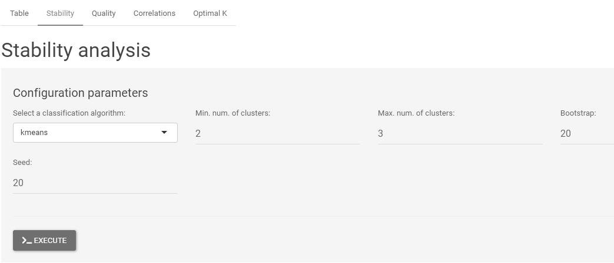

# evaluomeR-shiny

The `evaluomeR-shiny` repository hosts a Shiny-based web interface for the [evaluomeR](https://github.com/neobernad/evaluomeR) R package, designed to evaluate the reliability of bioinformatic metrics through clustering-based analysis and quantitative metric validation. This web portal enables researchers, including those with minimal technical expertise, to perform advanced analyses on biomedical and ontology datasets using an intuitive graphical interface.

## Overview

The `evaluomeR-shiny` web portal builds on the `evaluomeR` R package, available on [GitHub](https://github.com/neobernad/evaluomeR) and [Bioconductor](https://doi.org/10.18129/B9.bioc.evaluomeR). It provides a user-friendly platform for:
- **Metric Validation**: Assessing the reliability of bioinformatic metrics via correlation, stability, and goodness analyses.
- **Clustering Analysis**: Performing optimal clustering with methods like k-means and the Automated Trimmed and Sparse Clustering (ATSC) algorithm.
- **Data Preprocessing**: Handling high-dimensional datasets with techniques such as Principal Component Analysis (PCA).
- **Interactive Visualizations**: Offering data uploads, adjustable parameters, and graphical outputs for non-experts.



## Installation and Usage

To use the `evaluomeR-shiny` web portal locally:
1. Install R (version 4.5 or later) and the `evaluomeR` package from Bioconductor:
   ```R
   if (!require("BiocManager", quietly = TRUE))
       install.packages("BiocManager")
   BiocManager::install("evaluomeR")
   install.packages("shiny")
   ```
2. Clone or download this repository:
```bash
$ git clone https://github.com/neobernad/evaluomeR-shiny.git
``` 

3. Run the Shiny app:
```R
library(shiny)
shiny::runApp("path/to/evaluomeR-shiny")
```
